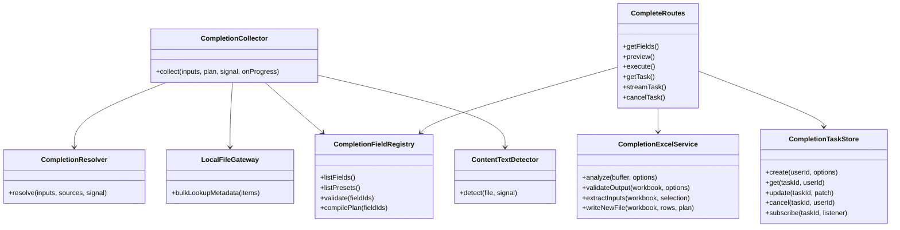
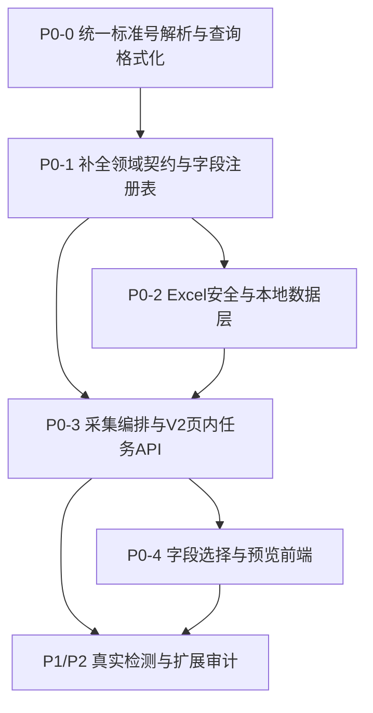

# StdHub「标准补全」可选属性导出优化方案

> 日期：2026-09-15  
> 状态：已评审，待实施  
> 范围：工具箱 → 标准补全

## 一、优化目标

当前标准补全只提供少量固定列：标准号、名称，以及状态、来源、下载链接、是否有文本等简单开关；模板模式也只固定回填名称、状态、性质、发布日期、实施日期和分类。

本次优化不应只是“多加几个复选框”，而应把标准补全升级为完整的**标准属性选择与安全补全工具**：

1. 根据任务选择需要的标准属性；
2. 提供常用、生命周期、分类、文件盘点和追溯审计预设；
3. 导出前显示实际列范围、字段覆盖度、处理成本和样例；
4. 区分未查到、上游异常、多候选、未检测和本地无文件；
5. 始终生成新工作簿，绝不覆盖或破坏用户原件。

## 二、推荐产品流程

上传 `.xlsx` → 选择工作表 → 确认表头行和标准号列 → 采用推荐安全输出列 → 选择预设或自定义字段 → 调整字段顺序 → 冲突检查 → 查看 8 行预览 → 执行补全 → 查看页内进度与结果统计 → 下载新文件。

### 必须改正的现状

- 前后端统一只宣称支持 `.xlsx`，移除页面中的 `.xls/.csv` 文案和 accept；
- 不再用“模板命中 3 个表头”自动决定标准号列；用户必须确认；
- 不再在标准号列缺失时回退到 A 列；
- 不再把所有匹配项的“是否有文本”固定写成“未检测”；
- 输出范围碰到任何原有值、公式、超链接、批注、数据验证或合并区域时，必须阻止执行；
- 输出结束列超过 Excel 最大列 XFD 时必须阻止。

### P0 前置修复：紧凑标准号统一规范化

普通搜索与标准补全目前存在同源问题：用户输入 `GB31658.17-2026` 时，普通搜索把原字符串直接发送给上游，而部分上游只能命中 `GB 31658.17-2026`；补全解析器的现有正则还可能把它错误拆成 `GB31` + `658.17`，最终查询 `GB31 658.17-2026`，因此显示“无法核验/未匹配”。

必须在所有标准号入口之前建立统一的解析与查询格式化能力，而不是仅在前端特判 `GB`：

1. 新增或扩展共享函数，例如 `parseStandardReference()` 与 `formatStandardSearchQuery()`，供普通搜索、批量解析、标准补全和查新共同使用；
2. 前缀必须按已知标准代号规则解析，不能使用允许前缀吞入数字的贪婪正则；`GB31658.17-2026` 应解析为 `prefix=GB`、`number=31658.17`、`year=2026`；
3. 上游查询格式化为 `GB 31658.17-2026`，但 UI 搜索框和历史记录保留用户原始输入，不强制改写显示；
4. 精确比对继续使用 `extractFullCode()` 的无空格规范键，例如两种输入都归一为 `GB31658.17-2026`；
5. 若输入不是可可靠识别的标准号，则保持普通关键词搜索，避免给中文名称等关键词错误插入空格；
6. 统一支持全角字母/数字/斜杠/小数点/连字符、前缀与数字之间有无空格、`GB/T31658.17-2026`、`GB/T 31658.17-2026` 等等价形式；
7. 搜索缓存键应使用规范化查询，避免紧凑形式和带空格形式产生重复缓存；
8. “无法核验”拆分为“输入格式无法识别”“已识别但未找到”“数据源查询异常”，禁止混成一个结果。

最低回归用例：

| 输入 | 上游查询 | 规范比对键 |
|---|---|---|
| `GB31658.17-2026` | `GB 31658.17-2026` | `GB31658.17-2026` |
| `GB 31658.17-2026` | `GB 31658.17-2026` | `GB31658.17-2026` |
| `GB/T31658.17-2026` | `GB/T 31658.17-2026` | `GB31658.17-2026` |
| `ＧＢ３１６５８．１７－２０２６` | `GB 31658.17-2026` | `GB31658.17-2026` |
| `31658.17-2026` | `31658.17-2026` | `31658.17-2026` |

这项排在字段注册表之前实施，因为所有新增导出属性都依赖标准号先被正确识别和匹配。

## 三、字段设计原则

所有字段使用稳定英文 `fieldId` 作为接口协议，中文表头仅作为展示文字，不能继续依靠多个 `includeXxx` 布尔值扩展。

建议字段注册表版本为 `registryVersion: 1`，每个字段定义：

- `fieldId`、中文名称、说明、分组、排序；
- 数据类型与格式化规则；
- 数据来源和覆盖度；
- 获取成本 L0-L4；
- 是否需要查询详情、本地文件关联或正文检测；
- 空值和错误语义；
- 敏感等级；
- 是否默认勾选、是否启用。

## 四、字段范围与优先级

### 4.1 P0 默认字段

| fieldId | 表头 | 来源与说明 |
|---|---|---|
| `standard.number.canonical` | 规范标准号 | 胜出来源返回的清洗后标准号 |
| `standard.title.zh` | 中文名称 | 标准摘要名称 |
| `lifecycle.status` | 标准状态 | 现行、即将实施、废止等 |
| `lifecycle.publishDate` | 发布日期 | 统一 `YYYY-MM-DD` |
| `lifecycle.implementDate` | 实施日期 | 统一 `YYYY-MM-DD` |
| `relation.replacesNumbers` | 代替标准号 | 当前标准取代了哪些旧标准 |
| `relation.replacedByNumbers` | 被替代标准号 | 哪些新标准取代了当前标准 |
| `local.fileState` | 本地文件状态 | 已有文件、本地无文件、文件异常 |
| `content.detectionState` | 正文检测状态 | 未执行、成功、失败、不适用 |
| `content.hasTextLayer` | 是否含文本层 | 是、否、未检测、不适用 |
| `match.state` | 查询/匹配状态 | 每一行必须有，可解释其他字段为何为空 |

#### 替代关系方向

- `relation.replacesNumbers` / **代替标准号**：本标准取代了哪些旧标准，即“我取代了谁”。当前 BZ `replacedStd` 已可提供。
- `relation.replacedByNumbers` / **被替代标准号**：哪些新标准取代了本标准，即“我被谁取代”。需要补充读取 BZ `detail-dm.insteadStd`。

两者不得互换。上游未提供时留空，不能写“无”。

#### 正文检测默认策略

为兼顾速度，“常用补全”默认展示正文检测两个字段，但默认不主动解析 PDF：

- 有本地文件但未开启检测：`正文检测状态=未执行`，`是否含文本层=未检测`；
- 无本地文件：`不适用`；
- 只有用户启用“执行正文检测”或选择“文件盘点”预设时，才实际解析本地 PDF。

### 4.2 P1 可选字段

#### 基础、分类和生命周期

- `standard.title.en`：英文名称；
- `classification.level`：国家/行业/地方/团体等标准层级；
- `classification.type`：数据源提供的标准类别；
- `classification.nature`：强制性、推荐性等；
- `classification.ics`：ICS 分类号；
- `classification.ccs`：CCS/中国标准分类号；
- `lifecycle.abolishedDate`：废止日期。

#### 本地文件

- `local.fileName`：本地文件名；
- `local.fileFormat`：文件格式；
- `local.fileSizeBytes`：文件大小；
- `library.ingestedAt`：表头使用“本地索引时间”，避免误称业务入库完成时间。

#### 来源、质量与诊断

- `trace.source`：实际采用的数据来源；
- `match.method`：完整号精确、规范化匹配、最新现行策略等；
- `quality.warnings`：来源冲突、字段缺失、截断、降级等；
- `error.summary`：脱敏后的短错误原因。

### 4.3 P2 高级字段

默认折叠、不勾选：

- 标准号前缀、顺序号、部分号、年代号；
- 多候选标准号列表；
- 本地文件页数、相对路径、SHA-256；
- 来源记录 ID、来源详情链接；
- 多来源冲突详情；
- 补全批次 ID、原始行号、系统版本。

### 4.4 暂缓且不得伪造

当前没有稳定来源或尚未统一验证，不开放：

- 替代关系类型、替代关系日期；
- 真正的上游元数据更新时间、最近同步时间；
- 独立的“入库状态”；
- 摘要、关键词；
- 复审日期、复审结论；
- 采标标准号、采标程度。

## 五、系统预设

1. **常用补全**：P0 字段；
2. **生命周期检查**：标准号、名称、状态、发布/实施/废止日期、代替/被替代标准号；
3. **分类清单**：标准号、名称、层级、类别、性质、ICS、CCS；
4. **文件盘点**：标准号、名称、本地文件状态、检测状态、文本层、文件名、格式、大小、本地索引时间；
5. **追溯审计**：标准号、名称、来源、匹配方式、匹配状态、质量提示、异常摘要。

P0 不做自定义预设持久化，可记住当前页面会话；后续再支持保存实例级模板。

## 六、字段选择交互

### 桌面端

- 左侧：可搜索的字段分组目录；
- 右侧：已选字段及最终导出顺序；
- 支持拖拽、上下移动、移至顶部/底部、删除；
- 字段行显示覆盖度、数据源、成本，以及“需详情”“需本地文件”“需正文检测”；
- 分组支持全选/取消全选；P2 显示暂不可用原因。

### 手机端

- 改为单列折叠分组；
- 不依赖拖拽，使用上下移动按钮；
- 底部固定“下一步/执行”按钮；
- 预览使用逐行卡片，不强塞宽表；
- 触控目标不低于 44px，错误不能只靠颜色表达。

### 输出范围

- 默认起始列为所选工作表最后一个安全已使用列的下一列；
- 实时显示预计范围，例如 `M:W，共 11 列`；
- 有冲突时禁用执行，并列出冲突单元格/列；
- 同名表头不智能覆盖，提示用户修改表头或更换起始列。

## 七、结果状态规范

接口使用英文稳定枚举，Excel 再格式化为中文：

| 字段 | API 枚举 | Excel 展示 |
|---|---|---|
| 查询/匹配状态 | `success / not_found / multiple_candidates / invalid_input / upstream_error / system_error` | 成功/未查到/多个候选/输入无效/上游异常/系统异常 |
| 本地文件状态 | `present / absent / error` | 已有文件/本地无文件/文件异常 |
| 正文检测状态 | `not_run / success / failed / not_applicable` | 未执行/成功/失败/不适用 |
| 文本层状态 | `yes / no / not_checked / not_applicable` | 是/否/未检测/不适用 |

输出规则：

- 业务属性没有可靠值时留空；
- 未查到、异常和未检测通过状态列说明，不能写进名称、日期等字段；
- 多值使用中文分号 `；`，去重并保持稳定顺序；
- 日期统一 `YYYY-MM-DD`；
- 不把网络异常降级成“未查到”；
- 无年份且存在多个版本时，默认返回“多个候选”，不静默选择第一条。

## 八、数据采集架构

新增补全专用链路，不直接扩大旧 `StandardResolver` 的职责：

1. **摘要快速层**：规范化、去重、逐源查询、保留候选和逐源错误；
2. **按需详情层**：只有用户选择英文名、ICS、反向替代关系等字段时才查询详情；
3. **本地文件关联层**：批量查询 SQLite `standard_files` 元数据；
4. **昂贵检测层**：仅用户主动开启时，对本地 PDF 实际解析文本对象。

约束：

- 重复标准号只查询一次，再展开回原行；
- 同一标准、同一来源的详情最多请求一次；
- 不按“字段数 × 行数 × 来源数”发送网络请求；
- 详情查询复用缓存和 single-flight；
- 每个来源继续使用独立并发限制；
- 多来源冲突默认采用用户来源优先级，但写入质量警告；
- 基础身份字段必须来自同一个胜出来源，不能拼成不存在的混合记录。

## 九、API 方案

### 9.1 字段目录

`GET /api/standards/complete/fields?registryVersion=1`

返回字段分组、预设、覆盖度、成本和启用状态。

### 9.2 预览

`POST /api/standards/complete/preview`

multipart 只提交：

- `file`：`.xlsx`；
- `options`：包含 API 版本、字段注册表版本、工作表、表头行、标准号列、输出列、有序 fieldIds、来源、检测策略、预览条数。

返回：

- 文件与配置指纹；
- 工作表列表；
- 有效、唯一、重复、无效行数量；
- 推荐起始列、实际结束列、冲突及警告；
- 查询/详情/本地关联/检测数量估算；
- 前 8 行真实样例；
- 六类匹配状态统计。

### 9.3 执行与页内进度

`POST /api/standards/complete` 返回 HTTP 202 和任务 ID。

页内提供任务状态、SSE 和取消接口，阶段为：

`queued → parsing → matching → fetching_details → linking_local_files → detecting_content → writing → complete`

SSE 断线时回退状态轮询。不增加独立任务中心。

执行必须重新加载工作簿，复核文件 SHA-256、配置指纹和输出碰撞，不能只信预览结果。

### 9.4 兼容策略

过渡一个版本同时接受 V2 `options` 和旧参数：

- V2 和旧参数禁止混传；
- 旧 include 参数映射为 fieldIds；
- 旧 `templateMode` 仅保留兼容入口，不能再自动回退标准号列；
- 前端本次直接切换 V2；
- 下一大版本移除旧参数。

## 十、Excel 安全要求

1. 始终复制完整 workbook 后在新列写入，生成新文件；
2. `preserveStyle=false` 也不能改成只生成结果表，否则会丢失用户原工作簿内容；
3. 推荐起始列避开值、公式、超链接、批注、数据验证、合并和安全相关样式；
4. 目标范围任一单元格被占用都阻断；
5. 输入列位于合并区域时阻断；
6. 目标范围进入隐藏列时显著警告；
7. 输入公式只读缓存结果，无缓存结果则该行标记输入无效；
8. 统一防止 `= + - @` 公式注入和非法控制字符；
9. 单元格超过 32,767 字符时安全截断，并加入质量提示；
10. 说明页默认关闭；用户开启时新增唯一名称的 `_StdHub补全说明`；
11. 输出先写入临时文件，重新打开校验后原子重命名；失败清理临时文件。

## 十一、资源保护线

P0 初始配置：

- 上传文件：10 MB；
- 工作表：20 个；
- used cells：300,000；
- 有效输入行：2,000；
- 唯一标准号：1,000；
- 单次选择字段：30 个；
- 真实预览：8 行，硬上限 10 行；
- 同时运行补全任务：1 个，排队 2 个。

所有阈值统一进入 `src/config.ts`。超限整体阻断并说明原因，不能静默截断。

## 十二、建议改造文件

### 新增

- `src/domain/completion.ts`：字段、枚举、任务和 API 类型；
- `src/services/completion-field-registry.ts`：字段注册表和预设；
- `src/services/completion-resolver.ts`：多候选、逐源异常和匹配方法；
- `src/services/completion-collector.ts`：四层采集编排；
- `src/services/completion-excel.ts`：安全预检与写入；
- `src/services/completion-task-store.ts`：页内任务、SSE 和取消；
- `src/services/content-text-detector.ts`：本地 PDF 文本层检测；
- `src/api/complete-routes.ts`：独立补全接口；
- 相关单元、API 和 E2E 测试。

### 修改

- `src/api/standards-routes.ts`：移出旧补全路由；
- `src/api/app.ts`：装配补全服务并接入 shutdown；
- BZ/GBW/BY adapter：只暴露真实可用属性；
- `src/services/library-index.ts`：批量查询文件 metadata；
- `src/shared/excel.ts`：强化安全值处理；
- `src/shared/errors.ts`：增加补全错误码；
- `src/config.ts`：容量、并发、队列、检测预算；
- `public/index.html`：坐标确认、字段选择、预览、进度；
- `public/js/app-complete.js`：V2 状态、字段、预览和任务恢复；
- 桌面与手机 CSS；
- `package.json`：仅真实文本层检测需要新增受控 PDF 解析依赖。

## 十三、实施顺序

### P0-0：统一标准号解析与查询格式化

- 将标准号预归一化、结构解析、上游查询格式化和精确比对键收口到共享模块；
- 修复 `GB31658.17-2026` 被错误拆成 `GB31` + `658.17` 的正则问题；
- 普通搜索仅对可靠识别为标准号的输入格式化，普通关键词原样查询；
- 搜索、批量解析、标准补全、查新复用相同规则；
- 增加紧凑/空格/斜杠/全角/小数部分号/裸号回归测试。

### P0-1：字段注册表和补全专用解析器

- 建立稳定 fieldId；
- 固化替代关系方向；
- 区分六类匹配结果；
- 保留逐源异常和多候选；
- 为所有启用字段建立来源测试。

### P0-2：Excel 安全预检和无覆盖写入

- 强制坐标确认；
- used range、冲突、合并、公式、隐藏列、XFD 校验；
- 批量本地 metadata；
- 原子生成新文件并重新打开校验。

### P0-3：V2 API 和页内任务

- `file + options`；
- fields/preview/execute/status/SSE/cancel；
- 配置及文件指纹；
- 资源限制、限流、队列和逐行失败归因；
- 旧接口兼容一版。

### P0-4：前端字段交互和 E2E

- 工作表/表头/标准号列确认；
- 搜索、分组、预设、排序；
- 冲突和 8 行预览；
- 页内进度、断线轮询、取消和结果摘要；
- 桌面和 375px 手机验收。

### P1/P2：真实检测及高级字段

- P1 开放已验证的英文名、分类、ICS/CCS、文件 metadata 和质量字段；
- 实现真实 PDF 文本层检测和缓存；
- P2 增加候选、页数、相对路径、哈希、来源记录和审计字段；
- 没有可靠来源的属性继续保持 disabled。

## 十四、测试与验收

至少覆盖：

- 紧凑、空格、斜杠、全角、小数部分号和裸号标准号；
- 字段注册表版本、未知/重复/禁用字段；
- 两个替代关系方向；
- 精确匹配、无年份多候选、未找到、输入非法、部分/全部来源异常；
- 重复输入只查询一次；
- 未选择详情字段不触发详情请求；
- 本地无文件、损坏文件、未检测、检测失败、扫描图 PDF；
- 非首工作表、非第 1 行表头、公式输入、隐藏列、合并区域；
- 输出范围首/中/末列冲突、XFD 恰好可写及溢出一列；
- 长文本、中文、emoji、公式注入、控制字符；
- 写入失败不留半成品、输出能被 ExcelJS 重新打开；
- 游客/管理员、CSRF、任务归属、取消、SSE 断线；
- 10MB/20 sheet/300k cell/2000 行/1000 unique/30 字段边界；
- 桌面和 375px 手机完整流程。

完成后依次运行：

```text
npm run build
npm run css:check
npm test
npm run test:e2e
git diff --check
```

## 十五、已确定的默认决策

1. 正文检测默认不主动执行；只有文件盘点预设或用户主动开启时检测本地 PDF。
2. 资源上限先采用本方案数值，实施后根据 NAS 压测调整。
3. 无年份且有多个候选时标记“多个候选”，不自动选择最新版本；后续可提供显式“选择最新现行版”策略。
4. 首版不提供独立入库状态，只提供本地文件状态和本地索引时间。
5. 无论是否保留样式，都复制完整 workbook 并写入新列，不生成丢失原表上下文的纯结果表。
6. 说明页默认关闭，`match.state` 默认开启，`error.summary` 作为可选字段。

## 附录 A：核心组件关系



## 附录 B：任务依赖



## 附录 C：依赖边界

继续使用现有 Express、Zod、Multer、ExcelJS、better-sqlite3、Vitest、Supertest 和 Playwright。只有落实“真实 PDF 文本层检测”时才新增 `pdfjs-dist`，并在实施时锁定兼容 Node.js 20 的版本；若不新增 PDF 解析依赖，P0 只能如实输出“未检测/不适用”，不得推测“是/否”。
